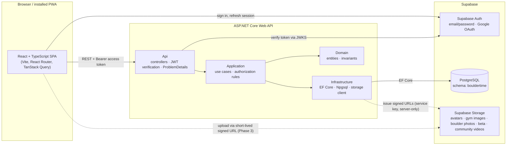

# Architecture



## Request flow

1. The SPA signs the user in with Supabase Auth and holds a short-lived access token.
2. Every API call carries `Authorization: Bearer <token>`.
3. The API verifies signature (JWKS, or legacy HS256 secret), issuer, audience and expiry.
4. `UserProvisioningMiddleware` ensures a `bouldertime.users` row exists for the token's `sub`.
5. Controllers call application services; **permissions are always read from the database** (gym staff
   relationships, platform-admin flag), never from token claims or request bodies.
6. Errors leave the API as RFC 7807 ProblemDetails with a stable `code` and `traceId`.

## Backend layers

| Project | Depends on | Contains |
|---|---|---|
| `BoulderTime.Domain` | nothing | Entities and invariants. No EF, no ASP.NET. |
| `BoulderTime.Application` | Domain, EF Core abstractions | Use-case services, validation, authorization checks, DTOs, `IAppDbContext`. |
| `BoulderTime.Infrastructure` | Application | `AppDbContext`, entity configurations, migrations, storage and clock implementations. |
| `BoulderTime.Api` | Application, Infrastructure | HTTP surface, auth wiring, error mapping, operator CLI. |
| `BoulderTime.Tests` | Api | Integration tests against real PostgreSQL (Testcontainers). |

A future native mobile client talks to the same REST API with the same Supabase tokens; nothing in the API is web-specific.

## Frontend structure

```
frontend/src
  app/          router and providers
  auth/         Supabase session context, route guard
  components/   shared UI (shell, states, form controls, logo)
  features/     one folder per domain area: API hooks + feature components
  lib/          API client, error model, Supabase client
  pages/        route-level screens
  styles/       brand tokens and global styles
```
